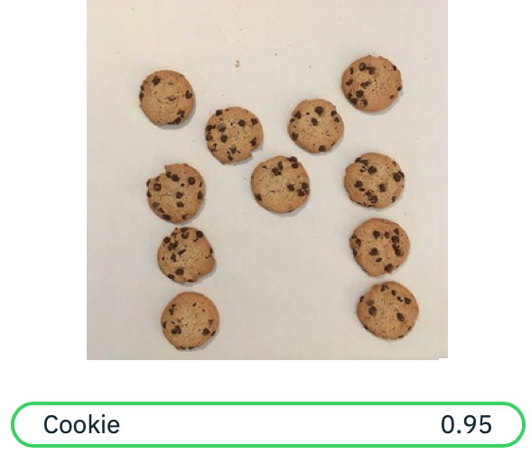
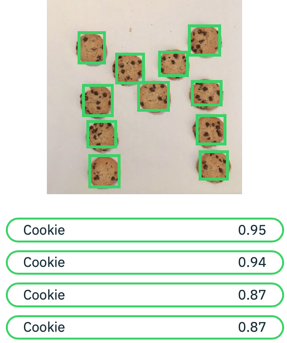

---

copyright:
  years: 2015, 2019
lastupdated: "2019-08-16"

keywords: custom object detection,object detection,bounding boxes,visual inspection
subcollection: visual-recognition

---

{:shortdesc: .shortdesc}
{:external: target="_blank" .external}
{:tip: .tip}
{:important: .important}
{:note: .note}
{:deprecated: .deprecated}
{:pre: .pre}
{:codeblock: .codeblock}
{:screen: .screen}
{:javascript: .ph data-hd-programlang='javascript'}
{:java: .ph data-hd-programlang='java'}
{:python: .ph data-hd-programlang='python'}
{:swift: .ph data-hd-programlang='swift'}

# Custom Object Detection (Beta)
{: #object-detection-overview}

{{site.data.keyword.visualrecognitionfull}} Custom Object Detection (Beta) identifies items and their location in an image. The service detects these items based on a set of images with labeled training data that you provide.
{: shortdesc}

Custom Object Detection is a beta feature. For more information about beta features, see the [Release notes](/docs/services/visual-recognition?topic=visual-recognition-release-notes#beta).
{: important}

You train the object detection model to recognize objects that are important to your workflow or domain. For example, detect damage to cars, find machines that need maintenance, or perform visual inspections in the field. You can also use object detection to count objects or manage inventory.

## Object detection and classification compared
{: #obj-detect-comparison}

The Custom Object Detection model is the newest feature in the {{site.data.keyword.visualrecognitionshort}} service, which includes classification.

Classification and object detection are similar but have different uses. In general, if you want to predict the existence of objects in an image, use classification. If you want to locate or count objects in an image, use object detection.

### Classification
{: #obj-detect-classify}

When you classify an image, the service responds with the probability that certain objects are in that image. You can use the built-in models (General, Food, or Explicit), or you can create your own custom model.

For example, when you classify an image of cookies such as the following image, the service predicts that there are cookies in the image with a 95% confidence.



### Object detection
{: #obj-detect-detect}

Custom Object detection is similar to custom classification, but the service identifies the location of items in the image. Like classification, the response also includes the label of each item it detected and the confidence in its identification.

The items that are detected are based on the information that you provide when you train an object detection model.

In the following image, the **Analyze images** method of Custom Object Detection identifies the location of cookies in the image. Each detected object includes the label (in this case, `Cookie`) with its location and a confidence score.



## How to use Custom Object Detection
{: #object-detection-sequence}

To use {{site.data.keyword.visualrecognitionshort}} Custom Object Detection, you follow this sequence of steps to set up a custom object detection model:

1.  Create a collection: A collection is a container for your images and training data. See [Create a collection](https://{DomainName}/apidocs/visual-recognition-v4#create-a-collection){: external} in the v4 API reference.
1.  Add your images to the collection. You can add single images by URL or by file, or you can upload a `.zip` file of images. See [Add images](https://{DomainName}/apidocs/visual-recognition-v4#add-images){: external} in the v4 API reference.
1.  Add training data to your images. See [Preparing your training data](#object-detection-preparation).
1.  Train your collection. After you have enough training data, start training on the images in the collection. See [Train a collection](https://{DomainName}/apidocs/visual-recognition-v4#train-a-collection){: external} in the v4 API reference.

After you complete these steps and train your collection, you can analyze images against it.

### Preparing your training data
{: #object-detection-preparation}

The most important part of the setup process is preparing and assembling your training data. Just as when you [create a custom model](/docs/services/visual-recognition?topic=visual-recognition-tutorial-custom-classifier#tutorial-custom-classifier) for classifying images, you assemble a set of images that represent the objects that you want to detect.

In addition to a set of images, you also provide training data for each image. For object detection, training data is the set of labels and locations for objects in the image that you want {{site.data.keyword.visualrecognitionshort}} to recognize. You can have more than one object in an image.

The label identifies what the object is. The location identifies where it is in the image. You identify the location by drawing a _bounding box_ around the object and providing the top and left pixel coordinates of that box, along with the width and height in pixels.

The following example shows the training data for an object labeled `BurntCookie`.

```json
{
  "objects": [{
    "object": "BurntCookie",
    "location": {
      "left": 33,
      "top": 8,
      "width": 163,
      "height": 119
    }
  }]
}
```
{: codeblock}

In this initial beta release, you create the location information by hand or by using an image annotation tool.

In general, the more images and bounding boxes that you provide in your training data, the better. Here are some training data guidelines to get you started:

- Each image is at least 500 pixels for both height and width.
- Each labeled object in the collection has at least 100 locations (bounding boxes).
- Each image in the collection has no more than 10 bounding boxes.
- The size of each bounding box is greater than 15% of the image dimensions.
- The API reads the EXIF orientation tags in your images. Make sure that the `location` coordinates match that orientation. To adjust the orientation, you can use a tool like ImageMagick to _auto-orient_ your images before you add bounding boxes.

For more information about the **Add training data to an image** method, see the [v4 API reference](https://{DomainName}/apidocs/visual-recognition-v4#add-training-data-to-an-image){: external}.

### Train the collection
{: #object-detection-train}

After you add the training data to images in your collection, the final setup step is to train an object detection model. A single call to the API starts the training, and the response includes status information. For example, the following status shows that training is started but is not yet complete:

```json
"training_status": {
  "objects": {
    "ready": false,
    "in_progress": true,
    "data_changed": false,
    "latest_failed": false,
    "description": "Starting training"
  }
}
```
{: codeblock}

You can retrain a model after you update the training data by reissuing the call.

For more information, see [Train a collection](https://{DomainName}/apidocs/visual-recognition-v4#train-a-collection){: external} in the v4 API reference.

## Analyze images
{: #object-detection-analyze}

After you set up a custom object detection model and the training is complete, you can detect objects in other images. As with classification, you provide an image or `.zip` file of images and an optional **threshold** to set the minimum score of detected objects. For more information, see the **Analyze images** method in the [v4 API reference](https://{DomainName}/apidocs/visual-recognition-v4#analyze-images).

## Next steps
{: #object-detection-next-steps}

- Get familiar with the API in the [v4 API reference](https://{DomainName}/apidocs/visual-recognition-v4){: external}.
