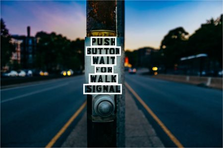

---

copyright:
  years: 2015, 2017
lastupdated: "2017-12-19"

---

{:shortdesc: .shortdesc}
{:new_window: target="_blank"}
{:tip: .tip}
{:pre: .pre}
{:codeblock: .codeblock}
{:screen: .screen}
{:javascript: .ph data-hd-programlang='javascript'}
{:java: .ph data-hd-programlang='java'}
{:python: .ph data-hd-programlang='python'}
{:swift: .ph data-hd-programlang='swift'}

# Text recognition in natural scenes (Beta)

Use the {{site.data.keyword.visualrecognitionshort}} beta Text model to detect and recognize English text in images. The Text model is designed to recognize scene text in images rather than the denser text in documents.

---

**Beta:** The Text model is a private beta feature, and you must have permission from {{site.data.keyword.IBM_notm}} to make calls to the model. If you have questions about access or about the Text model, contact Tammy Lew at ttlew@us.ibm.com. For more information about beta features, see [Release notes](/docs/services/visual-recognition/release-notes.html#beta).

[Go](/docs/services/visual-recognition/index.html) to the generally available docs.

---

The Text model works best on short text strings. For example, a common use of the Text model is to read signs.

 

The white boxes illustrate each word that the model recognizes in the image.

## The response
{: #response}

The response includes the detected string, and each word within that string is identified with the following information:

- The recognized word.
- A score that indicates confidence in the recognition of the word.
- The location of the bounding box around the word. The box indicates where the word is located in the image.
- A line number where the word was detected.

## Guidelines for good text recognition
{: #guidelines}

Text in images is better recognized when it adheres to these guidelines:

- The text is primarily full words, not strings of letters such as product codes. The model recognizes words rather than individual characters, and might discard single-letter "words" or numbers.
- The text is printed in a standard font, not a highly stylized one. For example, text in license plates or movie poster titles might not be recognized. Likewise, handwritten text might not be recognized.
- The Text model is trained mainly on English language words. Text in other languages likely won't be recognized.

## Next steps

Get familiar with the API in the [API explorer ](https://text-model-api-explorer.mybluemix.net/apis/visual-recognition-v3#/Text){: new_window}
