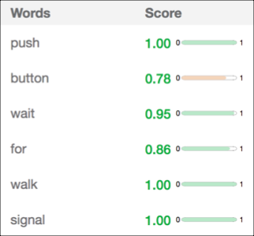

---

copyright:
  years: 2015, 2019
lastupdated: "2019-02-12"

---

{:shortdesc: .shortdesc}
{:new_window: target="_blank"}
{:tip: .tip}
{:important: .important}
{:note: .note}
{:deprecated: .deprecated}
{:pre: .pre}
{:codeblock: .codeblock}
{:screen: .screen}

<!-- Link definitions -->

[api-ref-text]: https://{DomainName}/apidocs/visual-recognition/visual-recognition-v3-text

# Text recognition in natural scenes (Beta)
{: #recognize-text}

Use the {{site.data.keyword.visualrecognitionshort}} beta Text model to detect and recognize English text in images. The Text model is designed to recognize scene text in images rather than the denser text in documents.

The Text model is a private beta feature, and you must have permission from {{site.data.keyword.IBM_notm}} to make calls to the model. [Request access ](https://datasciencex.typeform.com/to/nU6efl){: new_window}. For more information about beta features, see [Release notes](/docs/services/visual-recognition/release-notes.html#beta).
{: important}

The Text model works best on short text strings. For example, a common use of the Text model is to read signs.

 

The white boxes illustrate each word that the model recognizes in the image.

## The response
{: #recognize-text-response}

The response includes the detected string, and each word within that string is identified with the following information:

- The recognized word.
- A score that indicates confidence in the recognition of the word.
- The location of the bounding box around the word. The box indicates where the word is located in the image.
- A line number where the word was detected.

## Guidelines for good text recognition
{: #recognize-text-guidelines}

Text in images is better recognized when it adheres to these guidelines:

- The text is primarily full words, not strings of letters such as product codes. The model recognizes words rather than individual characters, and might discard single-letter "words" or numbers.
- The text is printed in a standard font, not a highly stylized one. For example, text in license plates or movie poster titles might not be recognized. Likewise, handwritten text might not be recognized.
- The Text model is trained mainly on English language words. Text in other languages is unlikely to be recognized.

## Next steps
{: #recognize-text-next-steps}

- [Make a call](/docs/services/visual-recognition/tutorial-recognize-text.html) to recognize text in an image.
- Get familiar with the API in the [API reference ][api-ref-text]{: new_window}.
